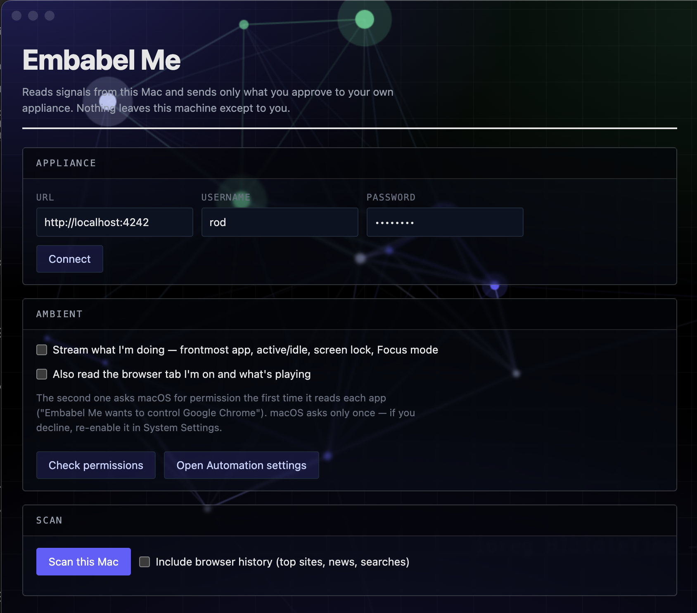

# Embabel Me — appliance

Run the whole product on your own machine with `docker compose up`. No JDK, no Maven,
no Node, no source checkout.

Your data and your code stay on your machine. The assistant talks to the model provider
*you* configure, with *your* key, directly — nothing routes through Embabel.

## Quick start

One line — it checks Docker, downloads the appliance into `~/embabel/worlds`, and hands
straight off to setup. It installs **Embabel Worlds**; `EMBABEL_MODE=me` before the
pipe installs the personal assistant instead:

```bash
curl -fsSL https://raw.githubusercontent.com/embabel-worlds/appliance/main/install.sh | sh
```

No account, no token, no GitHub login: this repo is public and the installer fetches
it anonymously. It installs nothing globally and needs no root. Read it first if you
like — [install.sh](install.sh) is deliberately short, and piping a remote script into
a shell is a thing you should be suspicious of.

Or clone it yourself:

```bash
git clone https://github.com/embabel-worlds/appliance.git && cd appliance

./me.py         # Embabel Me — the personal assistant   → http://localhost:11042
./worlds.py     # Embabel Worlds — the world runtime     → http://localhost:11044
```

One command is the whole thing: it starts the mode (pulling images on first run),
shows you the boot, walks you through your account and model-provider key, and ends
by telling you exactly where to go. Add `--fresh` to wipe everything and start over.

**Preconfigured worlds.** `./me.py --world <repo>` makes new worlds start from a
custom template instead of the default — an industry world with its realms already
installed, say. Takes a git URL, `owner/repo` on GitHub, or a bare name in the
embabel org; the resolved URL is echoed before anything uses it, and it applies
only when a world is first created — an existing world is yours and is never
reshaped. This is what a shareable install instruction looks like:

```bash
git clone https://github.com/embabel-worlds/appliance.git && cd appliance && ./me.py --world arts-world
```

Templates are the blessed way to preconfigure: named, versioned artifacts you
can audit and fix in one place — see [WORLD_TEMPLATES.md](WORLD_TEMPLATES.md)
for how inheritance works and how to mint a profile template in three files.

**Prerequisite: Docker Model Runner.** Embeddings run locally, so the appliance needs
it enabled — `docker desktop enable model-runner` (Docker Desktop 4.40+, or Settings →
AI), or the `docker-model-plugin` package on Docker Engine. Everything else is pulled.

`setup.py` needs nothing installed — Python 3 standard library only, no flags. It finds
the running mode, its port, and its setup token by itself (waiting out a still-booting
app rather than failing), walks you through each step, and checks your API key against
the provider before storing it, so a mistyped key fails there and then rather than at your
first message. Before it asks for account details or keys, it displays the complete usage-
reporting shape, destination and cadence and asks you to continue; a successful first-run
setup never hides the phone-home in a README you might not have opened.

You do not have to edit any file before starting. `.env` exists for optional extras
(integration keys, ports, tuning) — copy `.env.example` if and when you need one.

Watch the first boot with `docker compose logs -f assistant`.

```bash
docker compose ps                    # what's running
docker compose logs -f assistant     # follow the app
docker compose down                  # stop, KEEP your data
docker compose down -v               # stop and DELETE everything
```

## Two modes — Me and Worlds

The appliance is one product in two modes, running the **same image over the
same data**:

| Mode | Start with | Open | What it is |
|---|---|---|---|
| **Me** | `./me.py` | **11042** | the personal assistant — web UI, chat, memory |
| **Worlds** | `./worlds.py` | **11044** — the console | the world runtime — realms, documents, keys, views, chat, MCP, automations |

For Worlds, **11044 is where you go**: the console. The server itself is on 11043 —
that is the API and MCP endpoint, not where you go to look at anything.

`docker-compose.yml` is an alias for `docker-compose-me.yml`, so plain
`docker compose up` starts the Me mode. Everything mode-agnostic — the graph, the
local embedding model, document conversion, metrics — lives in `infra.yml`,
included by both.

First-run setup is the same `./setup.py` for either mode, with no flags: it finds
the running container by its compose service label and takes the port and setup
token from there.

Because the modes share one graph and one data volume, two rules hold:

1. **Run one mode at a time.** Both up at once means two identical JVMs running
   the singleton background work — cron firing twice, the same Telegram bot
   token connected twice (an API conflict, not just waste).
2. **`EMBABEL_VERSION` and the embedding model move both modes together** — they
   are set once, in `.env` and `infra.yml`, deliberately.

## Working on a realm

A realm is a set of capabilities that extends a world — actions, types, APIs,
producers, skills, handlers, apps. Authoring one normally means publishing it
somewhere the appliance can fetch from, and waiting: the fetch is cached by
`name@ref`, so a version that has not moved is a cache hit and an unpublished
change stays invisible even after a restart.

Point the appliance at your checkouts instead and it reads them in place:

```bash
./worlds.py            # asks, once, where your realm checkouts live
```

Answer with the directory they live **in** — the parent, so adding another realm
is a `git clone` rather than a change to any config. It is checked before it is
written: a path that does not exist, is not readable, is a realm rather than a
directory of realms, or is somewhere Docker Desktop does not share, is refused
with the reason. What it found is printed:

```
  Realm checkouts: /Users/you/dev
  4 realms visible: realm-esg, realm-github, realm-legal, realm-stripe
```

That writes `EMBABEL_REALMS_DIR` to `.env` and bind-mounts the directory at
`/realms`. A world then loads one by path instead of by repo:

```yaml
# config/realms.yml, in the world
- name: esg
  path: /realms/realm-esg
```

Non-interactively, or to change it later: `./setup.py worlds --realms ~/dev`.

**The mount is read-only, by design.** You edit on the host — where your editor,
your coding agent and your git remote already are — and push to your own GitHub
from there. The appliance only reads. One consequence to know rather than
discover: a realm's declared npm/wasm build runs as part of cloning, so it never
fires for a local realm. A declarative realm needs nothing; a realm with a build
step must be built on the host first.

## The Me app — a sensor for your Mac



The appliance thinks; the Me app senses. It runs natively on your Mac — outside
Docker, where a container cannot go — reads local signals, and **sends** what you
approve to your own appliance. It is a client of the appliance's API and never
listens on a port; nothing routes anywhere else.

`./me.py` offers to start it at the end of setup (and again on every re-run).
By hand:

```bash
cd me-app
npm start          # "Me" appears in the menu bar; the first run fetches Electron itself
```

Point it at your Me mode (`http://localhost:11042`) with your appliance login, and
it offers three things:

**Scan → review → send.** Every fact is shown before anything leaves the machine
and is individually deselectable. What it reads needs no special permission: the
Dock (the apps you keep at hand, in order), your default browser and mail app,
recent JetBrains projects and open VS Code folders, installed applications.
Optionally — off by default — your browser history: most-visited sites, which
news outlets you read *with the headlines you actually opened*, and recent
searches. Facts land in your assistant's memory as propositions, so it can answer
"what do you know about my machine?" and "what kind of news do I read?" from
evidence rather than a guess.

**Ambient streaming**, opt-in, in two tiers. Tier 0 needs no permission at all —
frontmost app, active or idle, screen lock, Focus mode — and samples every few
seconds. Tier 1 asks macOS for permission per app ("Embabel Me wants to control
Google Chrome") and adds the browser tab you are on and what is playing. This
feeds the assistant's sense of *right now*: it lives in memory, replaced on each
push, never written to the graph, and is what lets the assistant know not to
interrupt you.

**Local files.** Share folders — Documents, a projects directory — with the
appliance. Each is bind-mounted **read-only** into the assistant container
under `/local/<name>`; the panel writes a gitignored
`docker-compose.override.yml` next to the compose files (the tracked files
stay pull-only), wires the folders into the assistant's virtual Cypher, and
recreates the assistant container to apply it — the graph stays up throughout.
Sharing alone makes the files *queryable live* ("what changed this week?",
"which files mention the renewal?") with nothing copied or stored; tick
**index contents** on a folder to additionally embed its documents (PDFs
included) into the knowledge base for summarization and semantic search.

The app is **optional and additive**: the appliance is fully functional without
it. It is also a spike — unpackaged, so macOS prompts currently say "Electron"
rather than "Embabel Me". See [me-app/README.md](me-app/README.md) for the
platform seam (macOS is implemented; Windows and Linux are stubbed with their
gaps named) and the design rules behind the permission tiers.

## Ports — the 11042 block

**11042** is the one to remember; everything else counts up from it.

The number is the product's name. Babel is Genesis **11** — the tower, the
confounding of tongues. **42** is the Answer, and the Babel fish comes out of the
same book. It is unassigned by IANA, absent from `/etc/services`, and sits below
the Linux ephemeral floor of 32768 — which `0xBABE` (47806) does not, and which
would have made it fail intermittently and inexplicably forever.

An appliance owns **sixteen consecutive ports**, `EMBABEL_PORT_BASE` + offset:

| Offset | Port | Service | What it is |
|---|---|---|---|
| +0 | **11042** | assistant | **Me's front door** — web UI, REST API, tool gateway, MCP |
| +1 | 11043 | worlds | the Worlds server: API and MCP, not a place to look |
| +2 | **11044** | worlds-console | **Worlds' front door** |
| +3 | 11045 | neo4j | the knowledge graph, browser |
| +4 | 11046 | neo4j | the same, Bolt |
| +5 | 11047 | grafana | dashboards over the metrics — on by default |
| +6 | 11048 | prometheus | scrapes and stores them, 15 days by default |
| +7 | 11049 | open-webui | optional alternative chat front-end, off by default |
| +8…+15 | 11050–11057 | — | spare, so the next service does not need a new block |
| — | — | docling | PDF/DOCX/PPTX/XLSX → structured markdown, internal only |

Everything binds to `127.0.0.1` — reachable from your machine, not from the network.

**A second appliance takes the next block** (11058–11073), and a third the one
after. See [Running more than one](#running-more-than-one). The ceiling is 24
instances: the block after that would collide with Ollama on 11434, which the
appliance talks to.

### Signing in to each

| Service | How |
|---|---|
| assistant | the account you created during setup — see [Who can log in](#who-can-log-in) |
| neo4j | user `neo4j`, password `NEO4J_PASSWORD` (default `embabel-assistant`). The connect form comes pre-filled with `neo4j://localhost:11046` — Bolt on its host-published port; the usual 7687 is not published. Leave it as it is. If the browser remembers an *older* connect URL (it saves one per origin, and a stale one silently points you at a different database), open **<http://localhost:11045/browser/?dbms=neo4j://neo4j@localhost:11046&db=neo4j>** to force the right one, or run `:server disconnect` first |
| open-webui | create an account on first visit; the first account is the admin |
| grafana | no login — anyone who can reach 11047 is admin, which is safe only because it binds to `127.0.0.1` |
| prometheus | no login |

For scripted graph queries, use the shell inside the container — nothing to install:

```bash
docker compose -f docker-compose-worlds.yml exec neo4j cypher-shell -u neo4j -p embabel-assistant
```

Through compose, not `docker exec <name>`: no service declares a
`container_name`, so that a second appliance can exist — compose names them
`<project>-<service>-1` and you should not be memorising that. For another
instance, add `-p embabel-<name>`.

If you move the assistant off 11042, set `ASSISTANT_PORT` and nothing else: the container
port moves with it deliberately. The code sandbox is handed a callback URL built from the
server port, so a host port that differs from the container port would leave every
code-execution call dialling a port nothing listens on.

---

# Environment reference

Everything is configured through `.env` in this directory. Nothing is baked into an
image, so editing `.env` and running `docker compose up -d` applies any change.

Values are read by the container at start. Quote nothing unless the value contains
spaces, and never add trailing comments on a value line — `KEY=value # note` makes the
comment part of the value.

## Required — at least one model provider

The assistant cannot answer without one of these.

| Variable | Notes |
|---|---|
| `OPENAI_API_KEY` | The default provider for the shipped model configuration. |
| `ANTHROPIC_API_KEY` | Used by the app builder for stronger code generation, and available to any action configured for it. |

**You normally do not set these here** — `./setup.py` collects a key, validates it against
the provider, and stores it inside the data volume. If either variable is already exported
in the shell you run it from, it uses that instead of asking; `./setup.py --ignore-env`
always asks. Note that is your *shell's* environment, not `.env` — a key set only in `.env`
reaches the appliance but is invisible to the script, so setup still asks for one. Use `.env` if you would rather supply a
key up front (an air-gapped build, a scripted deployment, or to add a second provider after
setup); a key set here is picked up at boot exactly the same way.

Set both if you have both — model choice is per-action, so different parts of the product
route to different providers.

## Authorization fallback

Both modes default `ORG_ROLE_FALLBACK` to `admin` when no external organization role
provider is configured. This lets the setup-created operator use admin-gated local
surfaces. The fallback applies to **every authenticated principal**, not only that operator.
To opt out, set `ORG_ROLE_FALLBACK=user` in `.env`; every authenticated principal will then
receive the user role unless an external organization role provider resolves roles instead.

## Local embeddings — Docker Model Runner

Chat needs a provider key; **embeddings do not**. The compose file declares a local
embedding model (`ai/qwen3-embedding:0.6B-F16`, ~1.2GB, pulled like any image — the tag
is pinned because `latest` is a different, 4B model) that Docker Model
Runner serves as a host-side process — on Apple silicon that means Metal GPU
acceleration, and on every platform it means memory and document search cost no API
tokens and work offline.

This makes Docker Model Runner a requirement of the appliance:

- **Docker Desktop 4.40+** — enable it with `docker desktop enable model-runner`
  (or Settings → AI → *Enable Docker Model Runner*).
- **Docker Engine on Linux** — install the `docker-model-plugin` package from
  Docker's repository.

`docker compose up` fails fast with a clear message if the Model Runner is missing.
If you cannot run it, set `ASSISTANT_EMBEDDING_MODEL=text-embedding-3-small` in `.env`
to embed via OpenAI instead, and remove the `models:` element from the compose file.

**Switching embedding models on an existing install is a migration.** Stored vectors
were produced by the previous model and the Neo4j vector indexes are dimension-bound,
so after changing `ASSISTANT_EMBEDDING_MODEL` run the re-embed from *Settings →
Embedding model*. Until then, search results will be inconsistent.

## MCP access

The assistant is an MCP server, so Claude Code, Claude Desktop, Open WebUI and any other
MCP-aware client can drive it.

**You normally configure nothing here.** First-run setup's "Connect coding agents" step
mints a bearer token bound to the account you create, stores it in the data volume, and —
if the `claude` CLI is on your PATH — offers to run `claude mcp add` for you on the spot.

The `.env` variables exist for scripted deployments that skip the wizard, or to supply a
token before first boot:

| Variable | Default | Notes |
|---|---|---|
| `EMBABEL_MCP_API_TOKEN` | empty | Pre-set bearer token for `/mcp` and `/sse` (`openssl rand -hex 32`). A setup-minted token **takes precedence** — adding a value here after setup has minted one has no effect. |
| `EMBABEL_MCP_API_TOKEN_USER` | empty | Which user's world a pre-set token acts as. Both must be set together; there is no implicit default user. |

To wire a client manually (Claude Code shown; the URL + header work for any client):

```bash
claude mcp add --transport http --scope user embabel http://localhost:11042/mcp \
  --header "Authorization: Bearer <your token>"
```

A setup-minted token lives in the data volume at
`/data/embabel/assistant/admin/providers.env` — read it from there to wire additional
clients, or edit that file (and restart) to rotate it.

## Optional — integration credentials

Each unlocks a capability and is inert when empty; the assistant simply does not offer
what it has no credential for. These are resolved at the integration layer and are
**never injected into a prompt** — the assistant can call a tool that needs a token
without the model ever seeing the token.

| Variable | Unlocks |
|---|---|
| `BRAVE_API_KEY` | web search |
| `GITHUB_TOKEN` | the GitHub realm — issues, pull requests, repositories — and cloning **private** realms and world templates |
| `TELEGRAM_BOT_TOKEN` | chatting with the assistant from Telegram |
| `SLACK_APP_TOKEN` | chatting with the assistant from Slack |

Credentials for realms you install later don't need to go here: each world has its own
credential store, settable from the Channels tab in the World drawer or by editing that
world's `data/secrets.env`. Use `.env` for things the whole server needs.

## Ports

| Variable | Default |
|---|---|
| `ASSISTANT_PORT` | `11042` |
| `NEO4J_BROWSER_PORT` | `11045` |
| `NEO4J_BOLT_PORT` | `11046` |
| `OPEN_WEBUI_PORT` | `11049` |
| `GRAFANA_PORT` | `11047` |
| `PROMETHEUS_PORT` | `11048` |

All bind to `127.0.0.1`. Read [Who can log in](#who-can-log-in) before changing that.

## Optional services

`COMPOSE_PROFILES` is one comma-separated list and it is the whole truth — compose
reconciles the project to exactly those profiles on every `up`.

| Profile | What it starts |
|---|---|
| `openwebui` | Open WebUI on 11049 with the assistant pre-wired as an MCP tool server. Create an account on first visit; the first account is the admin. |

Grafana and Prometheus are **not** profile-gated — they are ordinary services and start
with everything else. A compose profile can only ever be *off* by default, since compose
activates one only when `COMPOSE_PROFILES` names it, and this appliance is designed to run
with no `.env` at all. To turn the dashboards off, delete those two services from
`docker-compose.yml`.

| Variable | Notes |
|---|---|
| `OPEN_WEBUI_SECRET_KEY` | Stable key so Open WebUI's encrypted credentials survive a container recreate. Any random string. |
| `OPEN_WEBUI_DEFAULT_MODEL` | Default chat model in Open WebUI (default `gpt-4.1`). |
| `PROMETHEUS_RETENTION` | How long samples are kept (default `15d`). Costs disk in the Prometheus volume. |

Set profiles **in `.env`**, not as an ad-hoc `--profile` flag. Compose reconciles the
project to the active profile set on every `up`, so a later plain `docker compose up -d`
would silently stop anything started under an ad-hoc profile.

### Metrics

Open <http://localhost:11047>. It lands on **Surface Health**; six more dashboards — LLM,
MCP Surface, HTTP & JVM, Graph & Tenancy, Code Mode & Sandbox, Virtual Cypher — are in
the dashboard list. There is no login: like every other port here it binds to
`127.0.0.1`, so anyone who can reach 11047 is an admin.

The dashboards ship inside the Grafana image and move with `EMBABEL_VERSION`, so they
always match the metrics the running assistant emits. That means they are read-only —
panel edits in the UI won't persist across a restart. Prometheus scrapes
`/actuator/prometheus` on the assistant every 10 seconds over the compose network.

## Tuning and infrastructure

| Variable | Default | Why you'd change it |
|---|---|---|
| `EMBABEL_VERSION` | pinned in the compose file | Pin to a specific release instead of tracking the default. |
| `ASSISTANT_DOC_CONVERTER` | `docling` | `none` uses plain text extraction and makes the multi-GB docling image unnecessary — faster to start, worse fidelity on tables and figures in PDFs. |
| `ASSISTANT_PUBLIC_BASE_URL` | `http://localhost:11042` | The externally visible origin. OAuth callbacks, MCP resource indicators and app links compose from it. Set it when running behind a proxy or on another host. No trailing slash. |
| `JAVA_OPTS` | `-XX:MaxRAMPercentage=75` | JVM memory. |
| `NEO4J_PASSWORD` | `embabel-assistant` | Change before the appliance is anything but local. |
| `NEO4J_HEAP` | `2G` | Raise for a large knowledge graph. |
| `TZ` | your host's zone (written by `setup.py`; `Etc/UTC` if undetectable) | The containers' — and so the assistant's — clock. Set it yourself only to override the detected zone (IANA name, e.g. `Australia/Sydney`). |

---

# Operating it

## Who can log in

Only the account you create during setup. Its password is stored as a bcrypt hash in the
data volume, and the appliance authenticates against that and nothing else — the built-in
demo identities (`alice`, `ben`, `nina`) exist as data but cannot sign in.

Until setup completes, **nobody** can sign in, and the setup API itself requires the token
from the container log. Once it completes, that API returns `410 Gone` permanently: there
is no second chance to create an administrator, with or without the token.

Ports still bind to `127.0.0.1` by default. Change that deliberately.

### Forgot the password?

```bash
./setup.py --reset-password
```

Recreates the operator account — it deletes the credential and setup-record files
from the data volume, restarts the mode, and walks first-run setup again. Everything
the appliance knows (graph, documents, memories) is kept; have your model-provider
key handy, because the wizard verifies it again. This works from the host on purpose:
the appliance never reopens setup over the API, but whoever controls Docker on the
host already owns the appliance.

### Starting over

Setup runs once per data volume. `docker compose down -v` erases everything — worlds,
documents, graph — and gives you a fresh appliance asking to be set up again.
`./me.py --fresh` (or `./worlds.py --fresh`) does the same across both modes and then
sets up, which is the usual way back to an empty appliance.

**`./setup.py --uninstall` goes one step further**, and the difference matters if you
are testing the experience rather than the software. `--fresh` leaves `.env` behind, so
the next run never asks for a provider key, a timezone or a realms directory — it
exercises none of the path a new user walks. `--uninstall` removes the state *and* this
machine's configuration: `.env`, `docker-compose.override.yml`, and the MCP registration
whose token died with the volume. What is left is what a fresh clone looks like, and
`./worlds.py` starts over from it.

It also offers to remove stray **code-sandbox containers**. Those are created by the app
through the Docker socket as siblings of the appliance rather than as compose services,
so `down` never sees them — and one whose JVM died without its shutdown hook is swept by
neither of the server's two cleanup passes. It asks rather than assumes, because an
assistant you are running from an IDE owns sandboxes carrying the same label.

Two things it deliberately keeps:

- **Images and the local embedding model.** The embedding artifact alone is over a
  gigabyte, and re-downloading one that has not changed is pure waste. There is no flag
  to remove them.
- **`realms/` and any realm checkout.** Those are your repositories and your work in
  progress; nothing here deletes them.

## What the assistant can reach

Worth knowing before you run it:

- **Your model provider key is used from your machine**, directly against OpenAI or
  Anthropic. Your data and your code are not sent to Embabel.
- **The appliance reports anonymous usage data to Embabel every 24 hours.** Counts and
  versions — never your data or code. There is no opt-out flag; instead, every field is
  listed in [PHONE_HOME.md](PHONE_HOME.md) and your own instance will show you the exact
  JSON it last sent. See [Usage reporting](#usage-reporting) below.
- **The assistant controls your host Docker daemon.** `/var/run/docker.sock` is mounted
  so it can run its per-user code sandbox — that is how it executes generated code.
  Control of the daemon is root-equivalent on the host. This is inherent to running a
  code sandbox; it is stated plainly so it is a decision rather than a surprise.

## Usage reporting

The appliance sends one small JSON report to Embabel every 24 hours: an installation UUID,
the version, host dimensions, and counts — users, worlds, realms, graph nodes, documents.
Never names, titles, content, queries, credentials or file paths, of anything. Realm names
in particular are counted but never sent.

**[PHONE_HOME.md](PHONE_HOME.md) is the complete field list.** You do not have to take it
on trust — ask your own instance:

```bash
curl -u <you> http://localhost:11042/api/v1/phone-home           # exactly what was last sent
curl -u <you> http://localhost:11042/api/v1/phone-home/preview   # what would be sent now
```

The `json` field is the literal request body, so it matches a packet capture byte for byte.
The first report is 10 minutes after startup, so a short evaluation never reports at all,
and an unreachable collector is dropped silently rather than slowing anything down.

First-run `setup.py` displays the destination, cadence, every payload field and the live
inspection URLs before it asks for account details or provider keys. It pauses for an
explicit continue action, and an interrupted setup shows the disclosure again when resumed.

There is no configuration flag to disable it, and the collector address is fixed in the
image rather than exposed in `.env` — a variable you could blank would be an opt-out by
another name, and we would rather say so plainly than ship one quietly. If your
environment forbids outbound telemetry, block the endpoint at your network.

## Your data

Two Docker volumes hold everything that matters:

| Volume | Contents |
|---|---|
| `embabel_assistant_data` | worlds — your configuration, documents, artifacts, apps |
| `embabel_appliance_neo4j_data` | the knowledge graph |

`docker compose down` keeps both. `docker compose down -v` destroys both. To back up:

```bash
embabel backup            # both volumes, plus .env and secrets.env, to ~/embabel-backups
embabel backup --list     # what is already there
embabel restore <folder>  # put one back, replacing what is here
```

The copy is cold — the appliance stops for it and starts again afterwards —
because Community Neo4j has no online backup and a graph copied live restores
as a corrupt graph. See [CLI.md](CLI.md) for what a backup folder holds and what
a restore replaces.

Three more volumes hold state you can throw away — `embabel_appliance_open_webui_data`,
`embabel_appliance_prometheus_data` (metric history) and `embabel_appliance_grafana_data`
(Grafana's own database; the dashboards live in the image, not here). Losing them costs
you chat history in Open WebUI and past metrics, nothing you authored.

## Running more than one

Two appliances on one machine — a stable one and one you are breaking, a
personal world and a client's — is a supported thing, and **you will not meet any
of it until you ask for it.** With one appliance there is no `--instance` flag in
`embabel --help`, no name to invent, and no verb for managing a thing you have
one of. The machinery appears the moment a second install makes it mean
something.

```bash
embabel up                              # the one you already have
embabel --instance client up            # a second, on the next port block
embabel instances                       # both, and where each answers
```

Instances differ in exactly three things, and everything else follows:

| | |
|---|---|
| **project** | `embabel-<instance>` — compose prefixes every container, volume and network with it, so two instances share nothing by accident |
| **settings** | `.env` for the default, `.env.<instance>` beside it. One checkout, several settings files — rather than several checkouts each with a copy of `setup.py` free to drift |
| **ports** | the next free sixteen, recorded as `EMBABEL_PORT_BASE` when the instance is created |

Once a second exists, verbs that could act on either will **ask** rather than
guess — picking one would be picking somebody's real graph as often as not:

```
$ embabel status
  2 appliances are installed here: appliance, client
  Say which one:  embabel --instance <name> status
  Or set EMBABEL_INSTANCE in your shell.
```

**No service declares a `container_name`.** A fixed name is global to the Docker
daemon, so the second install could not start; compose names containers
`<project>-<service>-1`. Find one by its compose labels, never by a name you
wrote down.

**Naming.** You pick it: `--instance <name>`, lowercase letters, digits, `-` and
`_`, starting with a letter or digit, up to 40 characters. The name becomes a
Docker project (`embabel-<name>`) and a filename (`.env.<name>`), which is where
the rule comes from and why anything else is refused. The default instance is
called `appliance` and you never have to type it.

**Code sandboxes separate too.** They are siblings created through the Docker
socket rather than compose services, so the server stamps each one with the
appliance that made it (`embabel-instance`). `embabel prune` acts only on the
current instance's, and a server run from an IDE labels its own `standalone` —
so it is never in the blast radius of an appliance's prune.

## Upgrading

```bash
embabel upgrade           # checkout, then images, then verify
```

Both halves. The images are most of the appliance, but the checkout is the rest
of it — the compose files, the Neo4j tag they pin, `setup.py`, the skills — and
pulling one without the other runs new servers against old plumbing.

The checkout pull is `--ff-only`, always: local changes are reported and left
exactly as they are, and the images still move. Afterwards it checks the
container's actual image id, because "pulled" and "the container is running it"
are different claims and only the second is the one you wanted.

Nothing is built. The compose files are pull-only by design, so `upgrade` lands
on what the registry publishes — and says so if that turns out to be *older* than
a locally-built image it just replaced.

Your volumes survive. Pin `EMBABEL_VERSION` in `.env` if you'd rather control when you
move between versions.

## Troubleshooting

| Symptom | Cause |
|---|---|
| `setup.py` cannot find the token | It already waits out a booting app, so the running container's log truly lacks one. `docker compose restart assistant` (or `worlds`) — the token is printed afresh on every boot until setup completes |
| `setup.py` reports 410 Gone | This appliance is already set up — just sign in |
| Login rejects the account you created | Setup was not completed; re-run `./setup.py` |
| Neo4j browser won't connect or log in | The user is `neo4j` — `embabel-assistant` is the default *password*. And the connect URL must be `neo4j://localhost:11046` (pre-filled; 7687 is not published to the host) |
| Neo4j browser connects, but shows unfamiliar data | It reconnected to a *saved* URL from an earlier session — another Neo4j on the host, not the appliance's. `:server disconnect`, then reconnect at `neo4j://localhost:11046`, or open <http://localhost:11045/browser/?dbms=neo4j://neo4j@localhost:11046&db=neo4j>. Confirm with `docker exec embabel-appliance-neo4j cypher-shell -u neo4j -p embabel-assistant "MATCH (n) RETURN count(n)"` — that shell can only ever reach the appliance's graph |
| Login page loads but chat never answers | No provider key took effect. The appliance restarts once at the end of setup for exactly this reason — check it came back with `docker compose ps` |
| `docker compose up` fails on an image pull | Not authenticated to ghcr.io — see [Registry access](#registry-access) |
| First code-execution turn hangs for minutes | The sandbox image is still downloading. `docker pull embabel/assistant-sandbox:latest` |
| `assistant` restarts during boot | Neo4j isn't healthy yet; it settles on its own. `docker compose logs neo4j` |
| Uploading a PDF fails | docling isn't up. `docker compose ps`, or set `ASSISTANT_DOC_CONVERTER=none` |
| An MCP client gets 401 | `EMBABEL_MCP_API_TOKEN` is empty, or the client's header doesn't match it |
| Nothing on 11047 | `docker compose ps` — if `grafana` isn't listed, it failed to pull. The image ships at the same `EMBABEL_VERSION` as the assistant |
| Dashboards load but every panel is empty | Prometheus can't reach the assistant. `curl localhost:11048/api/v1/targets` — the `embabel-assistant` target should be `up` |
| Port already in use | Change the port variables in `.env` |

When reporting a problem, `docker compose logs assistant > assistant.log` captures what's
needed. Check it for keys before sharing it.
